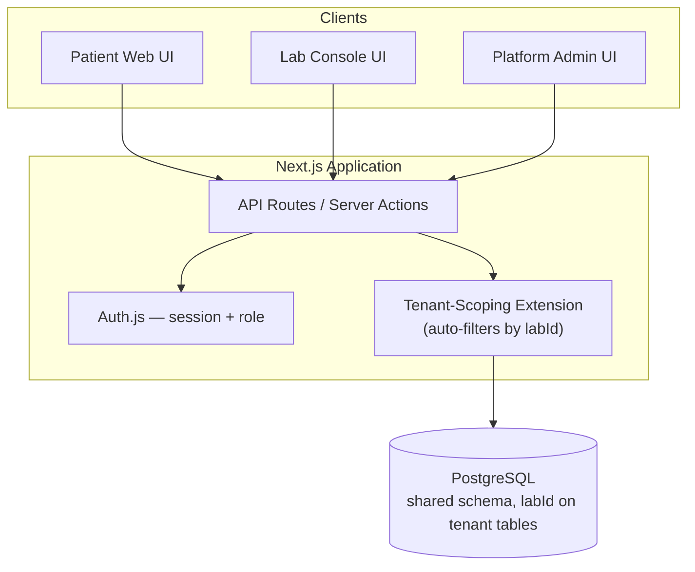
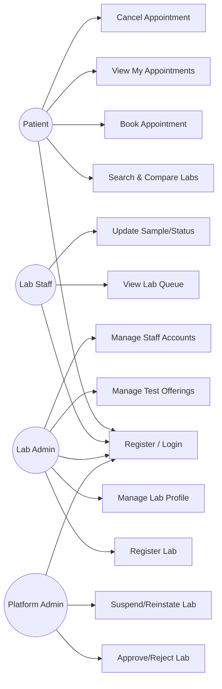
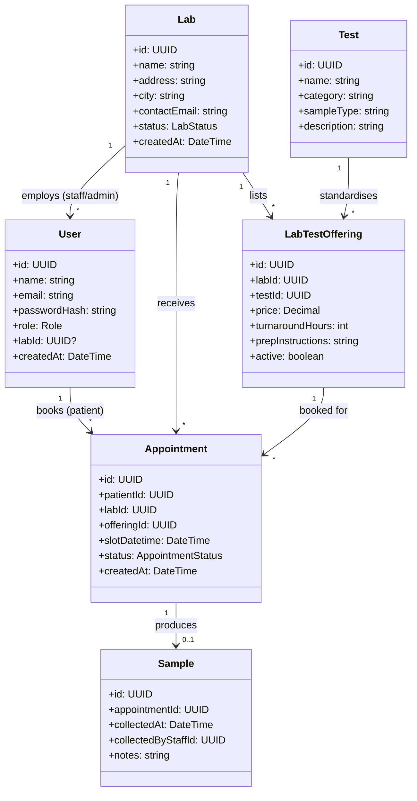
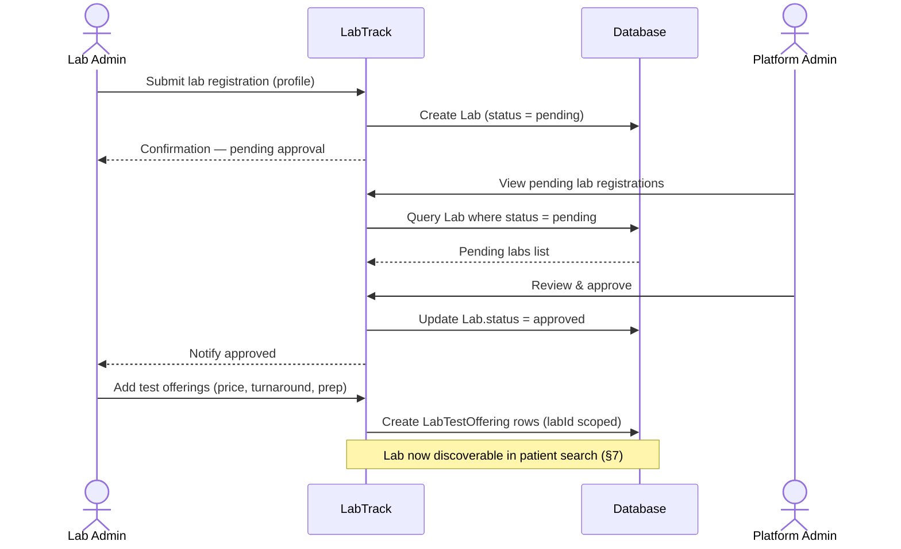
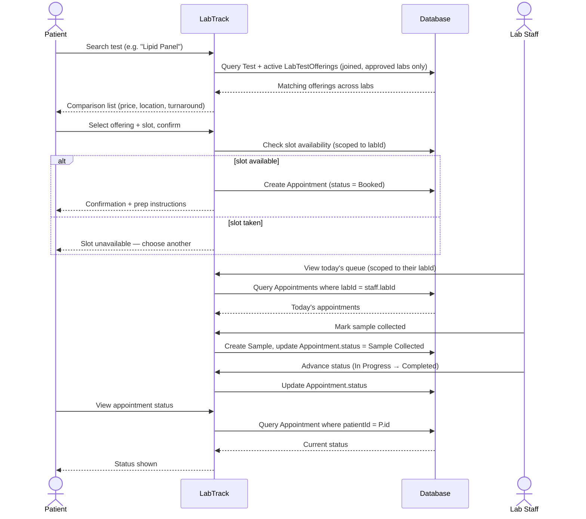
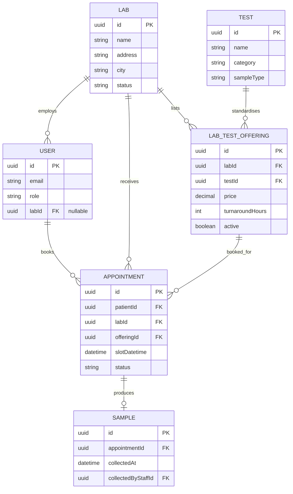

# System Design

**Project:** LabTrack — Multi-Tenant Diagnostic Lab Marketplace & Appointment Platform
**Author:** [Your Name]
**Version:** 1.0
**Date:** 2026-08-12

> Builds on `SRS.md` (requirements, actors, MoSCoW scope) and `Effort_Estimation.md` (use-case sizing). Diagrams selected are the ones that best communicate a multi-tenant system: architecture, tenant data model, use-case, class, two sequence flows, and ER — wireframes are described rather than drawn in full fidelity, appropriate for an initial release.

---

## 1. Technology Stack

| Layer | Choice | Why |
|---|---|---|
| Front-end | Next.js (React) + Tailwind CSS | Single framework covers three distinct UI surfaces (patient, lab console, platform-admin console) without standing up separate apps; fast to scaffold |
| Back-end | Next.js API routes (Node.js/TypeScript) | Keeps one deployable unit for a small team; avoids the coordination overhead of a separate backend service for an MVP |
| Database | PostgreSQL (managed, e.g. Supabase/Neon) | Relational integrity (foreign keys, unique constraints) is exactly what tenant-scoped data and slot-clash prevention need |
| ORM | Prisma | Typed schema/migrations, and its query-extension mechanism is the enforcement point for tenant scoping (§2) |
| Auth | Auth.js (NextAuth) or the managed provider's built-in auth | Password hashing and session handling out of the box, rather than hand-rolled — directly supports NFR1 |
| Hosting | Vercel (app) + managed Postgres | Cost-effective/pilot-tier per `SRS.md` §9, minimal ops overhead |

This stack is chosen for velocity on a small team, consistent with the effort estimate's assumption of scaffolding/tooling reuse (`Effort_Estimation.md` §4).

---

## 2. Multi-Tenancy Data Model Decision

**Decision: shared database, shared schema, with a `labId` column on every lab-scoped table, enforced through a single centralised data-access layer.**

Alternative considered: **schema-per-tenant** (or database-per-tenant) — rejected for this release because:
- The platform's core value is **cross-tenant search and comparison** (FR3, FR4) — this requires querying across labs in one pass; schema/DB-per-tenant turns that into a fan-out query across N schemas, adding real complexity for no benefit at pilot scale.
- The initial release onboards a small number of pilot labs (`SRS.md` §4 assumption); the operational cost of migrating N schemas in lockstep isn't justified yet.
- A shared schema lets tenant-scoping be enforced in **one place** — directly satisfying NFR7 ("tenant-scoping logic is centralised, not re-implemented per query"), which is the strongest available mitigation against an isolation bug (the single highest-severity risk identified in `Effort_Estimation.md` §3 and §6).

**Enforcement mechanism:** every Prisma query against a lab-scoped model (`Lab`, `LabTestOffering`, `Appointment` when accessed by staff/admin, `Sample`) is routed through a Prisma Client Extension that automatically injects a `where: { labId: session.labId }` filter for any session whose role is `lab_staff` or `lab_admin`. Application code cannot opt out of this filter — there is no code path that queries these tables without going through the extension. `platform_admin` sessions use a separate, explicitly-named unscoped client method, so a platform-wide query is always a deliberate, visible choice in the code rather than an accidental default.

This decision is the direct architectural response to NFR2 and FR27 in `SRS.md`, and is the first thing to verify under test (see the tenant-isolation checkpoint in `Effort_Estimation.md` §3 and `todo.md` Phase 4).

---

## 3. System Architecture



All three UI surfaces are one application with role-based routing/rendering, not three separate apps — this keeps the tenant-scoping enforcement point (§2) singular rather than duplicated.

---

## 4. Use-Case Diagram



Maps directly to the FR groupings in `SRS.md` §5; every Must-have FR has a corresponding node above. `Test` is still a platform-owned, shared catalog entity (see §5/§8), but per `SRS.md` §5's FR23 change note it's fixed seeded data for the initial release, not a use case the platform admin performs — hence no "manage test catalog" node here.

---

## 5. Class Diagram



`labId` appears on `User` (nullable — null for patients and platform admins), `Lab` itself, `LabTestOffering`, and `Appointment` — these are exactly the tables the tenant-scoping extension (§2) intercepts.

---

## 6. Sequence Diagram — Lab Onboarding



---

## 7. Sequence Diagram — Core Booking Flow



---

## 8. ER Diagram



A unique constraint on `(labId, offeringId, slotDatetime)` in `APPOINTMENT` is the database-level backstop for FR26 (slot-clash prevention) — the application check in §7 is the primary defense, but the constraint guarantees correctness even under concurrent requests.

---

## 9. UI Wireframes (low-fidelity)

**Patient — Search & Compare**
```
┌─────────────────────────────────────────────┐
│ Search: [ Lipid Panel            ] [Search]  │
│ Filter: Price ▾   Location ▾   Turnaround ▾  │
├─────────────────────────────────────────────┤
│ CityLab Diagnostics   GHS 80   Osu   24h  [Book] │
│ QuickTest Labs        GHS 65   Tema  48h  [Book] │
│ MedCheck Labs         GHS 95   Osu   12h  [Book] │
└─────────────────────────────────────────────┘
```

**Patient — Booking Confirmation**
```
┌─────────────────────────────────────────────┐
│ CityLab Diagnostics — Lipid Panel — GHS 80   │
│ Prep: Fast 12 hours before sample collection │
│ Slot: [ Tue 18 Aug, 9:00 AM ▾ ]              │
│                          [Confirm Booking]    │
└─────────────────────────────────────────────┘
```

**Lab Staff — Queue**
```
┌─────────────────────────────────────────────┐
│ Today's Queue — CityLab Diagnostics          │
├─────────────────────────────────────────────┤
│ 9:00  J. Owusu   Lipid Panel   [Mark Collected] │
│ 9:30  A. Mensah  CBC           Sample Collected │
│ 10:00 K. Boateng Lipid Panel   In Progress → [Complete] │
└─────────────────────────────────────────────┘
```

**Lab Admin — Test Offerings**
```
┌─────────────────────────────────────────────┐
│ CityLab Diagnostics — Test Offerings [+ Add] │
├─────────────────────────────────────────────┤
│ Lipid Panel   GHS 80   24h   Active  [Edit]  │
│ CBC           GHS 45   12h   Active  [Edit]  │
└─────────────────────────────────────────────┘
```

**Platform Admin — Pending Lab Approvals**
```
┌─────────────────────────────────────────────┐
│ Pending Lab Registrations                    │
├─────────────────────────────────────────────┤
│ MedCheck Labs — Osu   [View] [Approve] [Reject] │
└─────────────────────────────────────────────┘
```

---

## 10. Traceability to Requirements

| Diagram | Primary FRs covered |
|---|---|
| Architecture (§3) | NFR2, NFR7, NFR9 |
| Use-case (§4) | FR1–FR25, excluding FR23 (removed — see `SRS.md` §5 change note) |
| Class (§5) / ER (§8) | Entities underlying every FR |
| Sequence — onboarding (§6) | FR17, FR22 |
| Sequence — booking (§7) | FR3, FR4, FR7, FR8, FR13–FR15, FR26 |
| Wireframes (§9) | FR3–FR9, FR13, FR20, FR22 |
