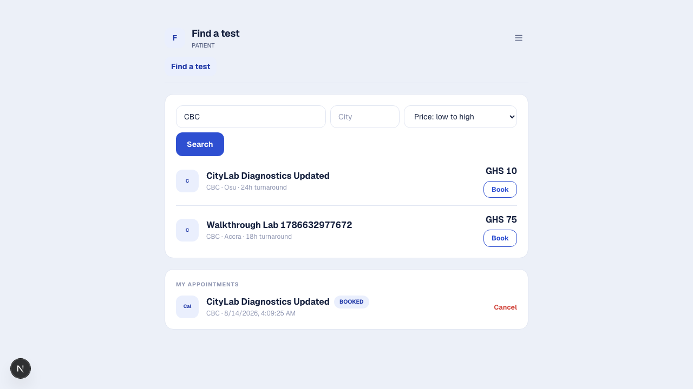
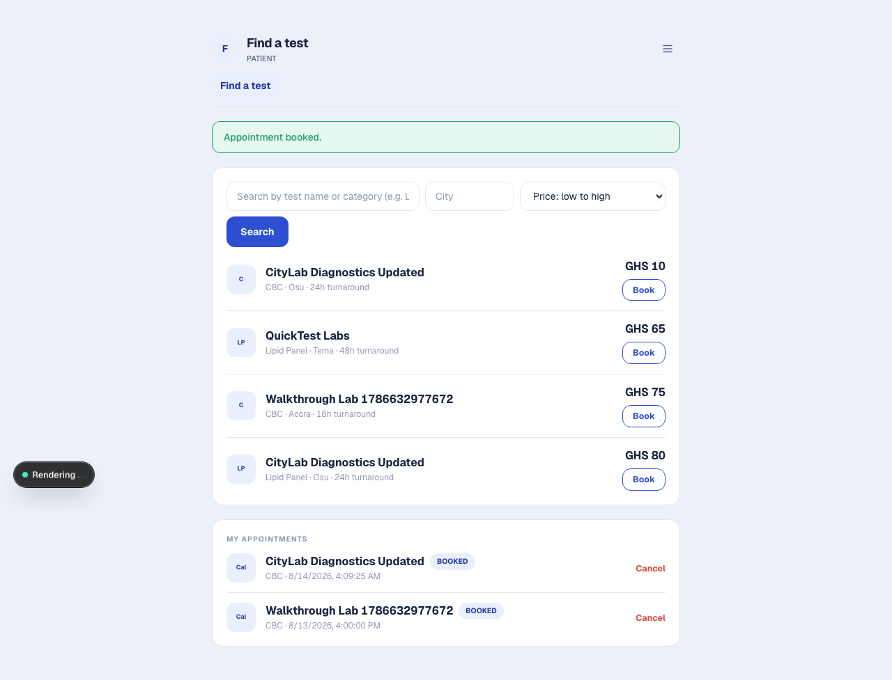
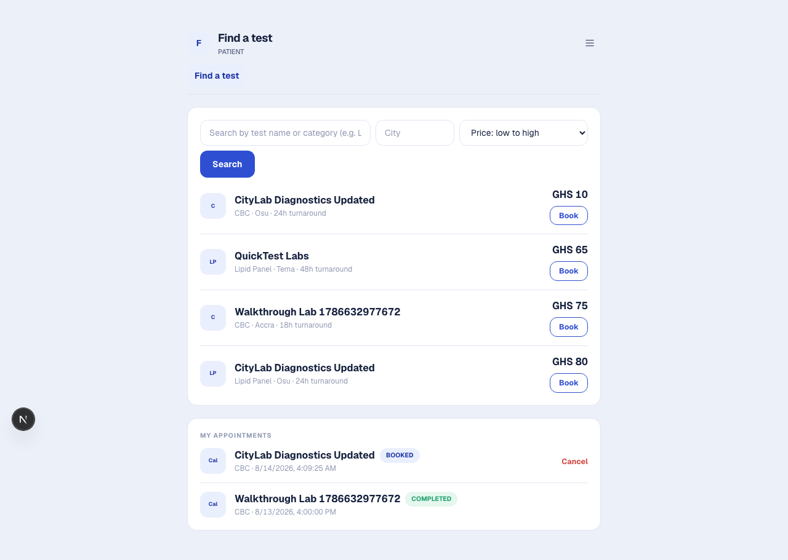
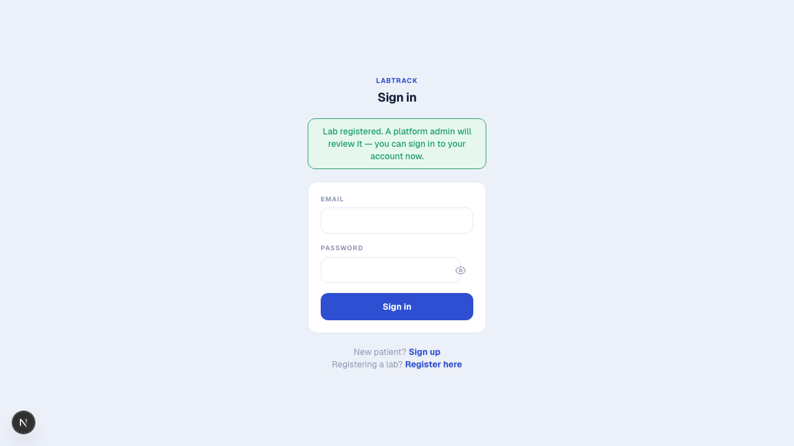
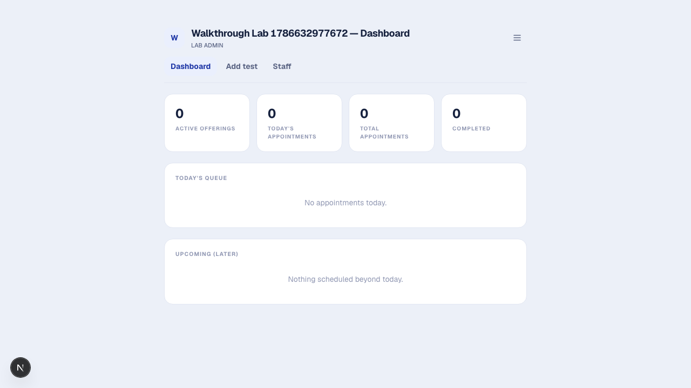
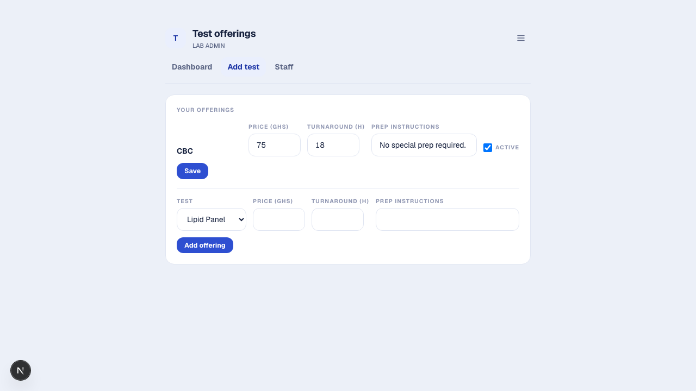
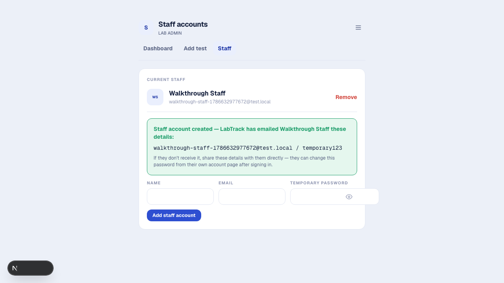
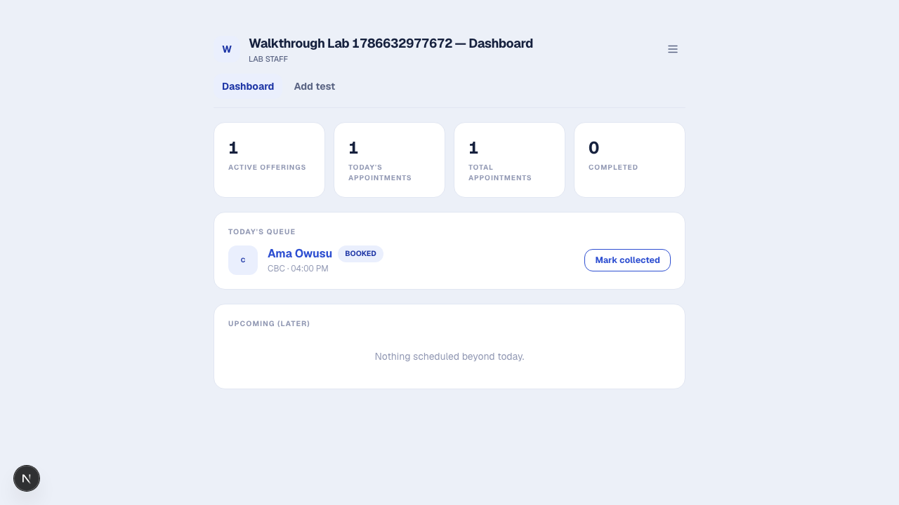
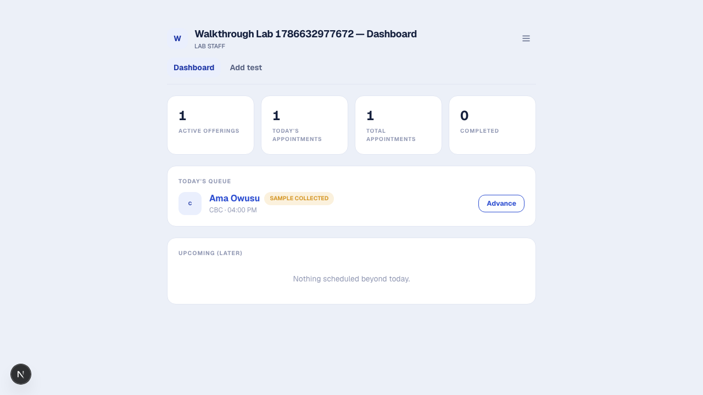
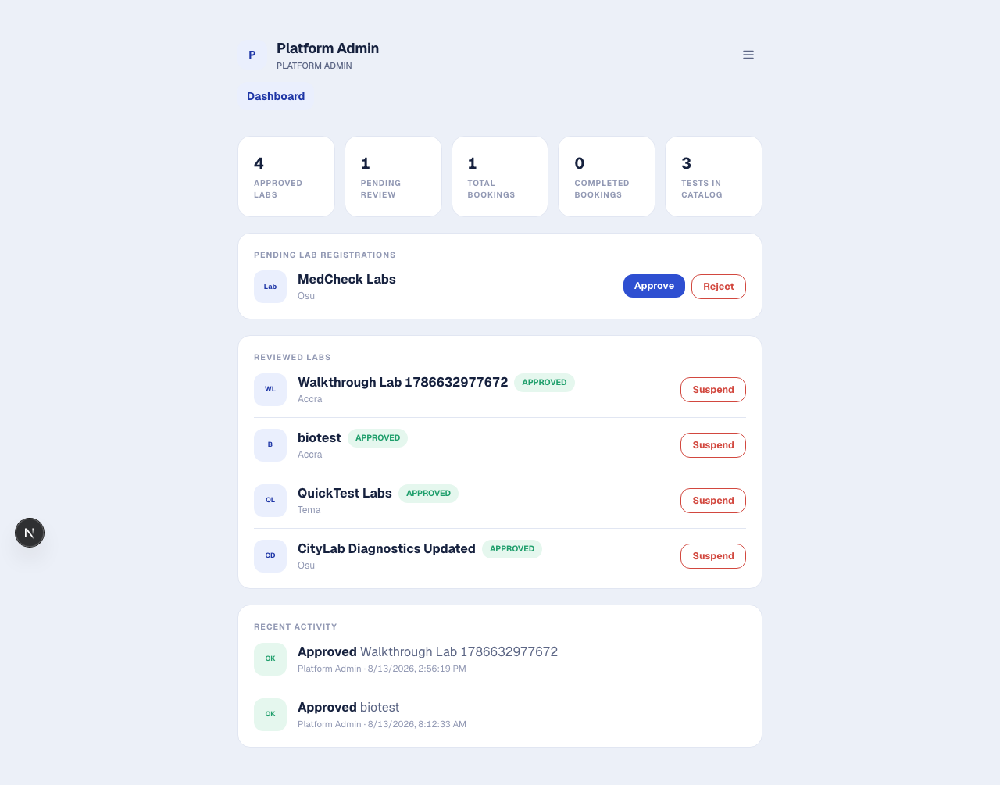

# User Manual for MediLab

**Prepared by:** Victoria Dowana (Student ID: 22425077)

Screenshots below are from the live Phase 4 system test walkthrough (`docs/Testing_Report.md` §6): real screens, not mockups.

## Getting started

Everyone signs in at `/login`. New patients register at `/signup` (or follow the "Sign in" link's "Register" option); new labs register at `/register`.

## Patient flow

1. **Register or log in.** Patients create an account with name, email, and password.
2. **Search and compare.** From `/patient` ("Find a test"), search by test name or category, optionally filter by city, and sort by price or turnaround time. Every matching lab's offering for that test is listed side by side.

   

3. **Book.** Click "Book" on the chosen offering, pick a date/time, and confirm. Prep instructions (if the lab provided any) are shown before you confirm.

   

4. **Track status.** "My appointments" on `/patient` shows every booking's live status: BOOKED → SAMPLE COLLECTED → IN PROGRESS → COMPLETED (or CANCELLED). Refresh the page to see updates as the lab processes your sample.

   

5. **Cancel.** A BOOKED (not yet sample collected) appointment can be cancelled from the same list.

## Lab registration and onboarding

1. **Submit for approval.** At `/register`, a prospective lab admin submits the lab's profile (name, address, city, contact email) and their own admin login. The lab starts in PENDING status and won't appear in patient search yet.

   

2. **Wait for platform admin review.** Until approved, `/lab` shows a banner explaining the lab is pending.
3. **Approval.** Once a platform admin approves the lab (see below), the banner clears and the lab becomes searchable.

   

## Lab admin flow

Everything a lab staff member can do, plus:

1. **Add test offerings.** From "Add test" (`/lab/offerings`), attach one of the platform's standardized tests to your lab with your own price, turnaround time, and prep instructions.

   

2. **Add a new test to the catalog, if needed.** On the same "Add test" page, "Can't find your test? Add a new test to the catalog" opens a small form (name, category, sample type, optional description). If a test with that name already exists, you'll be told to select it instead of creating a duplicate; otherwise the new test appears in the catalog immediately and you can attach your own offering to it right away.

3. **Manage staff.** From "Staff" (`/lab/staff`), add staff accounts for your lab. MediLab emails the new staff member their login details (and shows them on screen as a fallback); each staff member can change their password afterward from their own account page.

   

4. **Edit the lab profile.** "Lab profile" lets you update name, address, city, and contact email.

## Lab staff flow

1. **Log in** with the credentials your lab admin gave you.
2. **Today's queue** (`/lab`) lists every appointment scheduled for today at your lab.

   

3. **Process each appointment** through the pipeline as work happens:
   - **Mark collected:** records who collected the sample and when.

     

   - **Advance:** moves SAMPLE COLLECTED to IN PROGRESS.
   - **Complete:** moves IN PROGRESS to COMPLETED. The patient sees this update on their own "My appointments" list.

   Each step is enforced server side in that exact order, so the buttons shown always match what's actually valid to do next.

## Platform admin flow

1. **Log in**, land on `/admin`.
2. **Review pending labs.** Approve or reject each new registration.

   

3. **Suspend / reinstate.** An already approved lab can be suspended (removed from search, with staff/admin locked out of the dashboard) and later reinstated.
4. **Monitor.** The dashboard shows platform wide stats (approved labs, bookings, completed bookings, tests in the catalog) and a recent activity log of every approval, rejection, and suspension, so every action is auditable.

## Account management (all roles)

Every account has an account page (linked from the header's account menu) to change your password. Sign out from the same menu.

## Known limitations to be aware of

See `docs/Technical_Debt_Plan.md` for the full list. The ones most likely to be visible to a user: a cancelled appointment slot can't currently be rebooked by anyone (item 1); location search is by city text, not distance (item 4); there's no in platform payment, so arrange payment with the lab directly (item 6); results are tracked as a status only, not a structured value or file (item 7).
